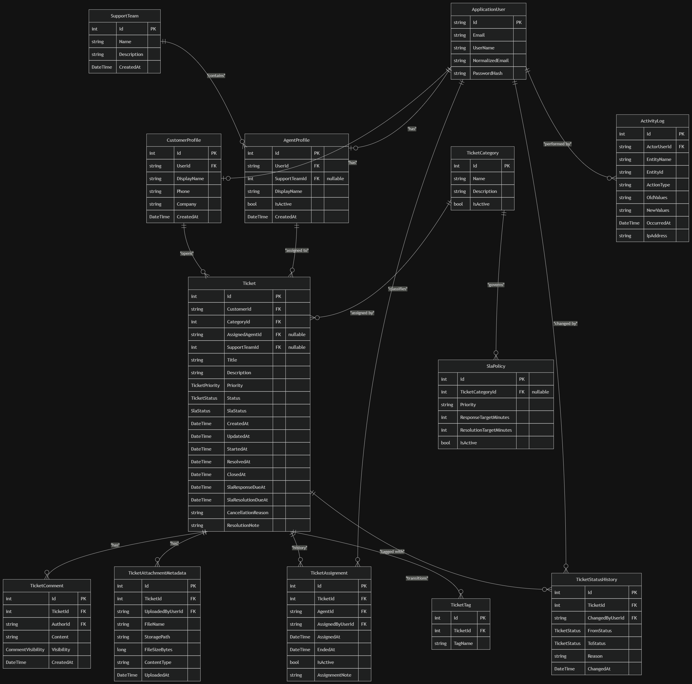

# Support Ticketing Platform

An enterprise-grade ticketing platform API built with Clean Architecture, CQRS (MediatR), and ASP.NET Core.

## Project Management
* **Jira Board (Scrum):** [View Jira Backlog & Active Sprints](https://abdelrhamanwael8.atlassian.net/jira/software/projects/KAN/list?jql=project+%3D+KAN+ORDER+BY+cf%5B10019%5D+ASC&atlOrigin=eyJpIjoiY2I2MjNjMDcwYmJiNGI4ZDgzMWFhNDZjNzg0YmExNjciLCJwIjoiaiJ9)

## Entity Relationship Diagram

*For the full database schema rules and relationships, see [docs/erd-design.md](docs/erd-design.md).*
